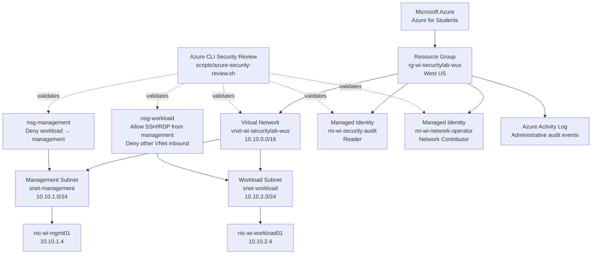

# Wu Industries — Azure Security Architecture

## Status

**Completed — Secured and Validated**

The Wu Industries Azure Cloud Security & IAM Lab was designed, deployed, secured, assessed, remediated, validated, monitored, automated, and documented in **West US**.

The final environment demonstrates Azure networking, segmentation, Network Security Groups, managed identities, Azure RBAC, least privilege, security monitoring, remediation, Azure CLI validation, and Bash-based security automation.

---

## Organization

**Wu Industries** is a fictional small business used to simulate a realistic Azure cloud environment.

The environment was designed around several business functions:

- IT / Cloud Administration
- Cybersecurity
- Finance
- Human Resources
- Operations

The architecture focuses on separating administrative resources from business workloads while applying least-privilege access controls.

---

## Azure Environment

### Subscription

Azure for Students

### Region

`West US`

### Resource Group

`rg-wi-securitylab-wus`

### Resource Tags

- Organization: `Wu Industries`
- Environment: `Lab`
- Project: `Azure-Cloud-Security-IAM`

---

## Deployed Resources

The completed environment includes:

- Resource Group: `rg-wi-securitylab-wus`
- Virtual Network: `vnet-wi-securitylab-wus`
- Management Subnet: `snet-management`
- Workload Subnet: `snet-workload`
- Management NSG: `nsg-management`
- Workload NSG: `nsg-workload`
- Management NIC: `nic-wi-mgmt01`
- Workload NIC: `nic-wi-workload01`
- Security Audit Managed Identity: `mi-wi-security-audit`
- Network Operator Managed Identity: `mi-wi-network-operator`
- Azure Activity Log
- Azure Cloud Shell
- Azure CLI security validation
- Bash-based security review automation

---

## Network Design

### Virtual Network

Name:

`vnet-wi-securitylab-wus`

Address space:

`10.10.0.0/16`

The Virtual Network contains two segmented subnets.

---

### Management Subnet

Name:

`snet-management`

Address range:

`10.10.1.0/24`

Purpose:

- Administrative resources
- Management systems
- Restricted administrative access
- Trusted source network for SSH and RDP management traffic

Associated Network Security Group:

`nsg-management`

Test network interface:

`nic-wi-mgmt01`

Private IP used during validation:

`10.10.1.4`

---

### Workload Subnet

Name:

`snet-workload`

Address range:

`10.10.2.0/24`

Purpose:

- Business workloads
- Test systems
- Security configuration exercises
- Network security assessment

Associated Network Security Group:

`nsg-workload`

Test network interface:

`nic-wi-workload01`

Private IP used during validation:

`10.10.2.4`

---

## Network Security Design

Network Security Groups provide subnet-level segmentation between management and workload resources.

### Management NSG

Name:

`nsg-management`

Associated subnet:

`snet-management`

Custom inbound rule:

#### Deny Workload to Management

- Name: `Deny-Workload-to-Management`
- Priority: `200`
- Source: `10.10.2.0/24`
- Protocol: `Any`
- Destination port: `Any`
- Action: `Deny`

This rule prevents systems in the workload subnet from initiating connections into the management subnet.

---

### Workload NSG

Name:

`nsg-workload`

Associated subnet:

`snet-workload`

Custom inbound rules:

#### Allow Management SSH

- Name: `Allow-Management-SSH`
- Priority: `100`
- Source: `10.10.1.0/24`
- Protocol: `TCP`
- Destination port: `22`
- Action: `Allow`

#### Allow Management RDP

- Name: `Allow-Management-RDP`
- Priority: `110`
- Source: `10.10.1.0/24`
- Protocol: `TCP`
- Destination port: `3389`
- Action: `Allow`

#### Deny Other Virtual Network Traffic

- Name: `Deny-Other-VNet-Inbound`
- Priority: `200`
- Source: `VirtualNetwork`
- Protocol: `Any`
- Destination port: `Any`
- Action: `Deny`

The resulting design allows explicitly authorized administrative traffic from the management subnet while restricting other inbound Virtual Network traffic.

---

## Identity and Access Architecture

Microsoft Entra ID tenant-level user and group administration was unavailable because the Azure for Students subscription was connected to a university-managed directory.

User-assigned managed identities were therefore used to demonstrate Azure RBAC, least privilege, and separation of duties without attempting to bypass tenant restrictions.

### Security Audit Identity

Managed identity:

`mi-wi-security-audit`

Azure RBAC role:

`Reader`

Scope:

`rg-wi-securitylab-wus`

Purpose:

Provide read-only visibility into Azure resources without modification permissions.

---

### Network Operator Identity

Managed identity:

`mi-wi-network-operator`

Azure RBAC role:

`Network Contributor`

Scope:

`rg-wi-securitylab-wus`

Purpose:

Allow network administration without granting broad Contributor or Owner-level permissions.

This design demonstrates:

- Least privilege
- Separation of duties
- Job-function-based access
- Scoped RBAC permissions

---

## Security Assessment Architecture

The project used the following security assessment workflow:

**Identify → Assess Risk → Remediate → Validate → Document**

Two controlled security findings were completed.

### Finding 001 — Overly Permissive SSH

A temporary inbound rule allowed SSH from any source.

The rule was assessed, removed, and validated through Azure CLI.

Final secure state:

SSH is restricted to:

`10.10.1.0/24`

---

### Finding 002 — Excessive RBAC Permissions

The network operator identity was temporarily assigned the broad:

`Contributor`

role.

The excessive role was removed, leaving only:

`Network Contributor`

Azure CLI was used to validate the final least-privilege state.

---

## Logging and Monitoring

Azure Activity Log was used to investigate security-relevant administrative actions.

The Activity Log provided audit evidence for:

- Removal of the excessive RBAC role assignment
- Removal of the temporary overly permissive SSH rule

This demonstrated administrative change tracking and security-event investigation within Azure.

---

## Azure CLI Validation

Azure Cloud Shell and Azure CLI were used to validate:

- Virtual Network configuration
- Subnet configuration
- Subnet-to-NSG associations
- Management NSG rules
- Workload NSG rules
- Managed identity RBAC assignments
- Removal of insecure SSH access
- Removal of excessive Contributor permissions

This provided direct control-plane validation of the deployed configuration.

---

## Security Automation

A Bash-based Azure CLI security review script was created:

`scripts/azure-security-review.sh`

The script automatically reviews:

- Resource group information
- Virtual Network configuration
- Subnet and NSG associations
- Management NSG rules
- Workload NSG rules
- Managed identity RBAC assignments
- SSH source restrictions
- Presence of temporary unrestricted SSH rules
- Presence of excessive Contributor permissions

Final automated checks returned passing results for all configured security controls.

---

## Environment Constraints

### Microsoft Entra ID

Tenant-level Microsoft Entra ID user and group administration was unavailable because the Azure subscription was connected to a university-managed directory.

Managed identities were used instead to demonstrate Azure IAM and RBAC concepts.

### Virtual Machines

Live virtual machines were not deployed because an eligible free-tier VM size was unavailable in the selected Azure region.

Paid virtual machines were intentionally avoided to maintain the project's cost-management requirements.

As a result, the project does not claim live SSH, RDP, or packet-flow testing.

Network and IAM controls were instead validated through:

- Azure Portal
- Azure CLI
- Azure Activity Log
- Automated Bash security checks

---

## Architecture Diagram

---

## Security Design Principles

The completed architecture demonstrates:

- Network segmentation
- Restricted administrative access
- Defense in depth
- Azure RBAC
- Least privilege
- Separation of duties
- Managed identities
- Administrative audit logging
- Security misconfiguration assessment
- Risk-based remediation
- Configuration validation
- Security automation
- Cost-aware cloud engineering

---

## Final Architecture State

At project completion:

- The management and workload networks are segmented.
- Workload-to-management traffic is restricted.
- SSH and RDP administrative access is limited to the management subnet.
- Managed identities use job-function-based RBAC.
- Excessive Contributor permissions have been removed.
- The temporary unrestricted SSH rule has been removed.
- Security remediation actions are recorded in Azure Activity Log.
- Azure CLI validates the deployed security configuration.
- Automated security checks return passing results.

The environment was left in its intended secured state.

---

## Related Documentation

- [Project README](../README.md)
- [Project Journal](project-journal.md)
- [Security Findings](security-findings.md)
- [Final Security Assessment](final-security-assessment.md)
- [Evidence Screenshots](evidence/)
- [Azure Security Review Script](../scripts/azure-security-review.sh)

